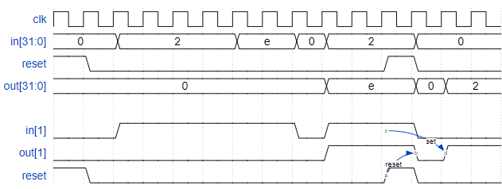

# Problem Statement

For each bit in a 32-bit vector, capture when the input signal changes from 1 in one clock cycle to 0 the next. "Capture" means that the output will remain 1 until the register is reset (synchronous reset).

Each output bit behaves like a SR flip-flop: The output bit should be set (to 1) the cycle after a 1 to 0 transition occurs. The output bit should be reset (to 0) at the positive clock edge when reset is high. If both of the above events occur at the same time, reset has precedence. In the last 4 cycles of the example waveform below, the 'reset' event occurs one cycle earlier than the 'set' event, so there is no conflict here.

In the example waveform below, reset, in[1] and out[1] are shown again separately for clarity.

[Find the verilog Solution](solution_verilog.v)
