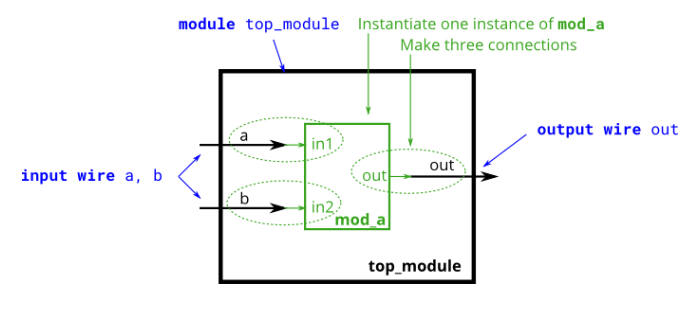

# Problem Statement

By now, you're familiar with a module, which is a circuit that interacts with its outside through input and output ports. Larger, more complex circuits are built by composing bigger modules out of smaller modules and other pieces (such as assign statements and always blocks) connected together. This forms a hierarchy, as modules can contain instances of other modules.

The figure below shows a very simple circuit with a sub-module. In this exercise, create one instance of module `mod_a`, then connect the module's three pins (in1, in2, and out) to your top-level module's three ports (wires a, b, and out). The module mod_a is provided for you — you must instantiate it.

When connecting modules, only the ports on the module are important. You do not need to know the code inside the module. The code for module mod_a looks like this:

```verilog
module mod_a ( input in1, input in2, output out );
    // Module body
endmodule
```


The hierarchy of modules is created by instantiating one module inside another, as long as all of the modules used belong to the same project (so the compiler knows where to find the module). The code for one module is not written inside another module's body (Code for different modules are not nested).

You may connect signals to the module by port name or port position. For extra practice, try both methods.



### Hint

**Connecting Signals to Module Ports**

There are two commonly-used methods to connect a wire to a port: by position or by name.

**By position**

The syntax to connect wires to ports by position should be familiar, as it uses a C-like syntax. When instantiating a module, ports are connected left to right according to the module's declaration. For example:

```verilog
mod_a instance1 ( wa, wb, wc );
```

This instantiates a module of type mod_a and gives it an instance name of "instance1", then connects signal wa (outside the new module) to the first port (in1) of the new module, wb to the second port (in2), and wc to the third port (out). One drawback of this syntax is that if the module's port list changes, all instantiations of the module will also need to be found and changed to match the new module.

**By name**

Connecting signals to a module's ports by name allows wires to remain correctly connected even if the port list changes. This syntax is more verbose, however.


```verilog
mod_a instance2 ( .out(wc), .in1(wa), .in2(wb) );
```

The above line instantiates a module of type mod_a named "instance2", then connects signal wa (outside the module) to the port named in1, wb to the port named in2, and wc to the port named out. Notice how the ordering of ports is irrelevant here because the connection will be made to the correct name, regardless of its position in the sub-module's port list. Also notice the period immediately preceding the port name in this syntax.